# Optimind User Guide

This document is a detailed user guide for Optimind software. 

**Optimind** is a Workflow Management System (WMS). It means that Optimind helps the users (usually engineers) to automate complex processes (workflows).

## Table of Content

1. [Introduction](#optimind-user-guide)
1. [Deployment](#deployment)
3. [Launching Optimind](#launching-optimind)
	- [Choosing a workspace](#choosing-a-workspace)
	- [Switching to Optimind Perspective](#switching-to-optimind-perspective)
	- [Setting Optimind templates](#setting-optimind-templates)
4. [Creating an Optimind project](#creating-an-optimind-project)
5. [Creating a Workflow](#creating-a-workflow)
6. [Using existing examples](#using-existing-examples)
6. [Creating Tasks](#creating-tasks)
	- [Tasks](#tasks)
	- [Library Tasks](#library-tasks)
	- [Subtasks](#subtasks)
6. [Handling inputs and outputs](#handling-inputs-and-outputs)
	- [Setters](#setters)
	- [Connections](#connections)
	- [Outputs](#outputs)
7. [Generating Python code](#generating-python-code)
7. [Creating Subtasks](#creating_subtasks)
8. [Generating a Workflow Graph](#generating-a-workflow-graph)

## Deployment 

Like all Eclipse projects, this app does not require to be installed or configured. Deployment of an Eclipse based app instead only requires unzipping the archive automatically generated after compiling the project.
Furthermore, to unburden the user from any installation process, the product can be delivered with the JRE (Java Runtime Environnement).
All set-up files, including the executable, are therefore found in a user defined directory.

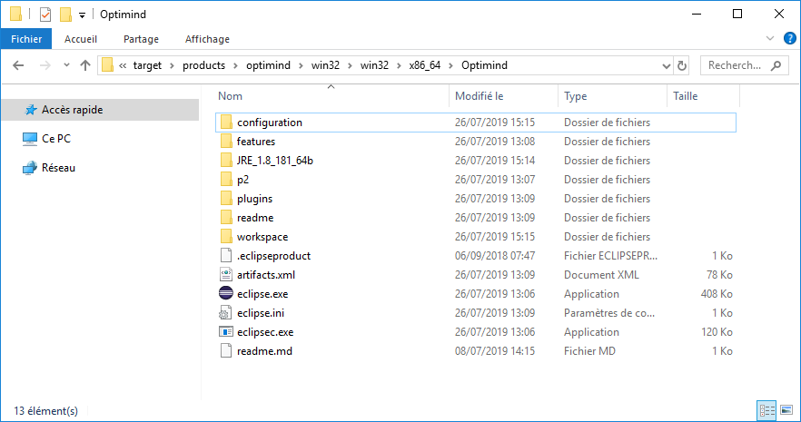

## Launching Optimind

After accessing the set-up repository, double clicking the executable should launch the following loading screen.

### Choosing a workspace

Once all modules making up our products are loaded, a "Dialog Page", allowing us to select a "workspace", should appear. This workspace is a repository where our Optimind workflow projects will be created.

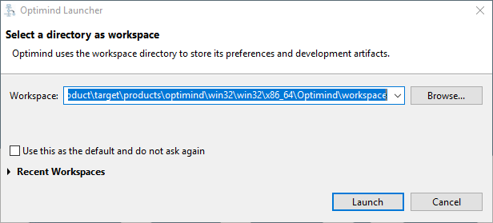

### Switching to Optimind Perspective

Once our workspace is selected, the app's main window (or "workbench") should appear with a default perspective. The perspective dictates how the different views of the workbench are layed out (e.g. we can move the "Project Explorer" view to right from its default position on the left).

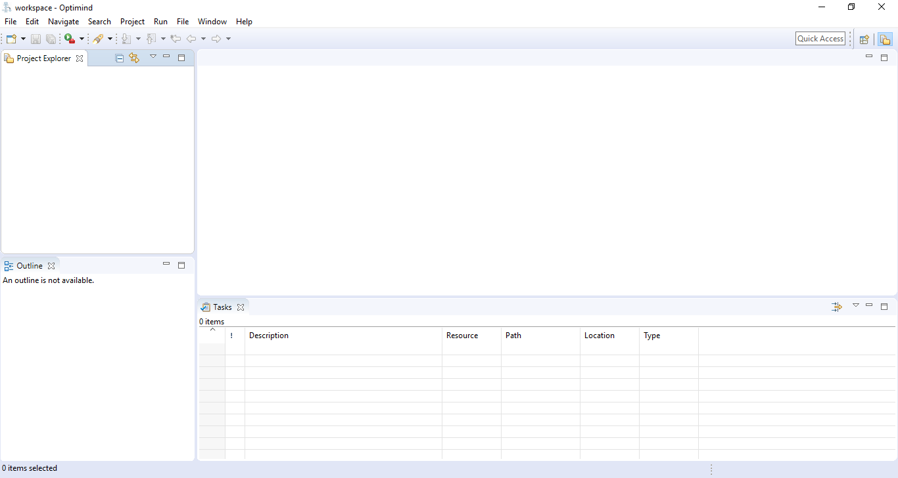

A perspective dedicated to Optimind workflow handling was created for this project. To chose this perspective, we just move to the "toolbar" on the top right and click the  icon. The "Open Perspective" dialog box should appear :

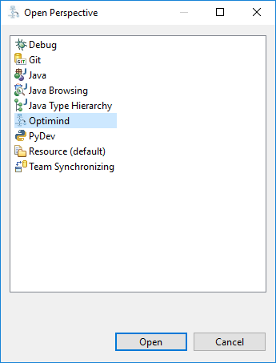

This should lead to our new workbench as follows :

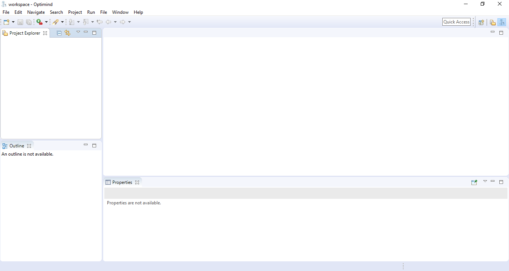

### Setting Optimind templates

In the "Preferences" window, in the "Optimind" category, chose "Templates". From there, you can manage your templates. First, chose "Import...", select your template file, and "Apply and Close".

## Creating an Optimind project

We can now start by creating an "Optimind" project. There are several ways to do so :

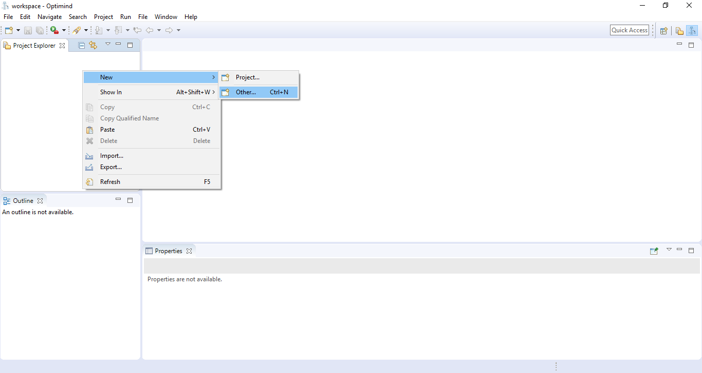

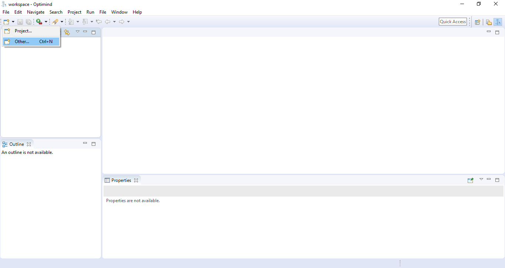

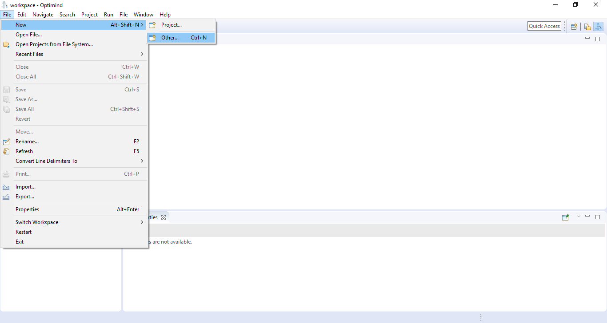

Whichever method is used, the user should see a "wizard" asking him to chose a project type :

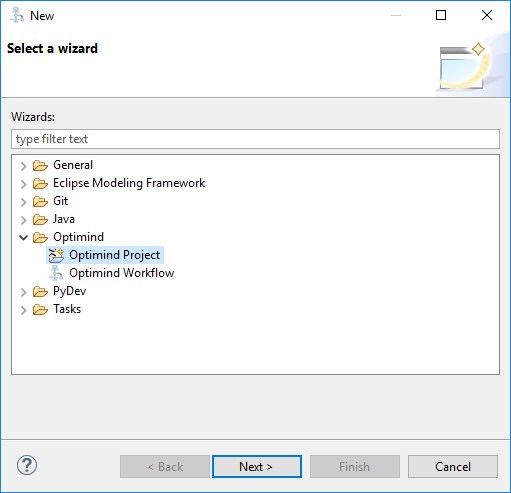

In the "Optimind" category, we find two types of project : "Optimind Project" and "Optimind Workflow". In this case we shall chose the former.
A second page of the "wizard" should then appear, prompting us to chose the name as which the project will be saved.

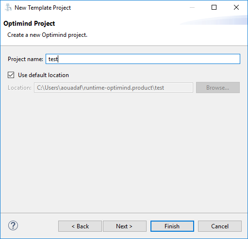

The wizard's next page allows us to chose an Optimind project already set-up with certain tasks between "templates" (only "Empty Workflow" for now).

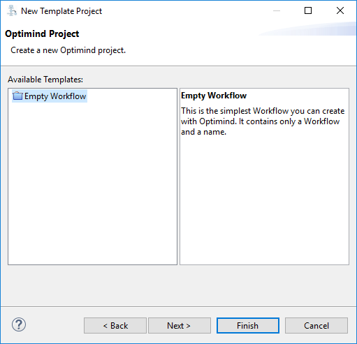

The last page allows us to set certain project parameters, like the package name in which our ".optimind" file will be stored.

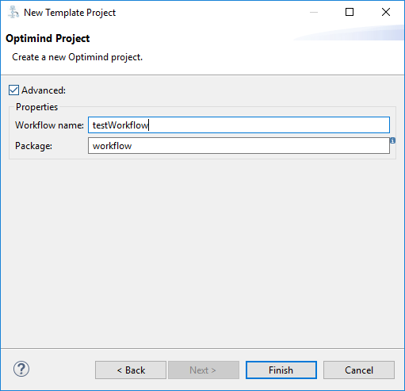

Clicking "Finish" leads us to our newly created analysis project in the "Project Eplorer".
 
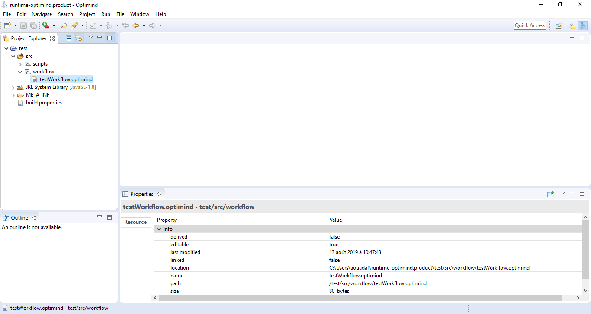

As our project was successfully created, we can now open the ".optimind" file with the text-based editor, by double clicking it in "Project Explorer".

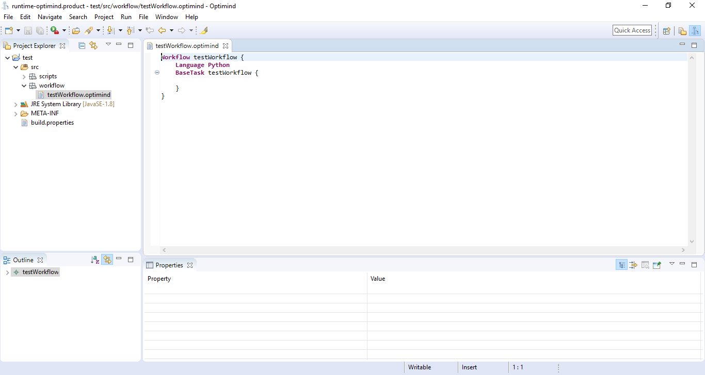

We can now start editing our workflow. The Optimind text-based editor offers contextual help to assist users in the creation of their workflow. Press *Ctrl+Space* to open the contextual help box.

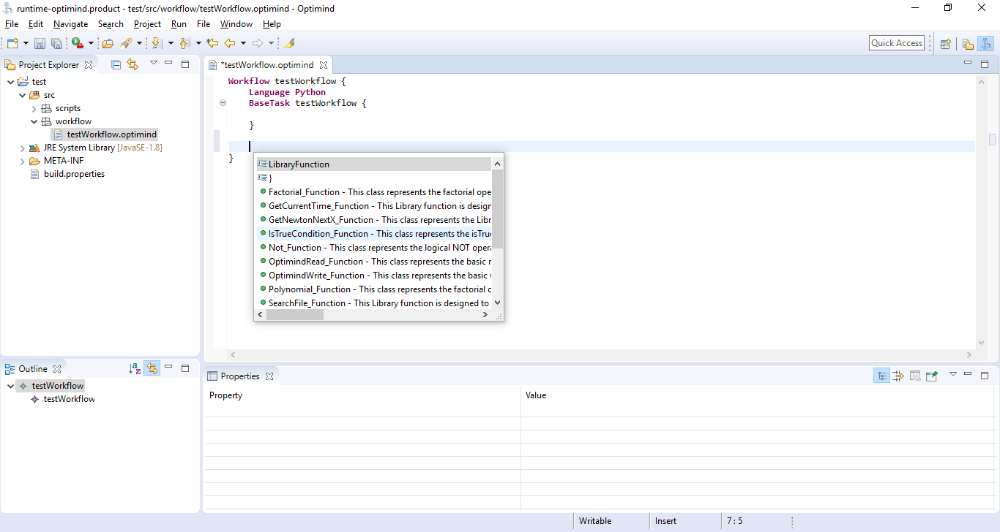

## Creating a Workflow

The first step of creating a workflow in our project is sthe as that for creating the project. However, in the "wizard", "Optimind Workflow" should be chosen.

The new workflow should be located in the "workflow" folder of our project. A name, as well as a Template to base the workflow on should be chosen. "Empty Workflow" is the workflow to be used to start a workflow from scratch.

Our new workflow should now appear in the "Project Explorer".

## Using existing examples

## Generating Python code

## Creating tasks 

### Tasks

Tasks can be created from scratch by selecting "Task" in the contextual help. A blank task should appear in the editor. Each new task must be given :

* A name, between th "Task" keyword and the curly braces {}.
* A runner, inside the curly braces. In our example, the runner will be a python script.

Inputs and outputs will also be added in between the curly braces.

The python script should be automatically generated and should appear (after saving and refreshing) in the Project Explorer.

### Library tasks

"Library tasks" reference a "Library Function" as their runner. These functions must be included in the *.optimind* file outside of tasks. 

Users can find a list of available library fuction and tasks in the contextual help. Clicking once displays the code that will be added in the text-based editor, and double clicking adds it. Once added, the "library function" should appear in the "Outline" panel in the bottom left hand corner.

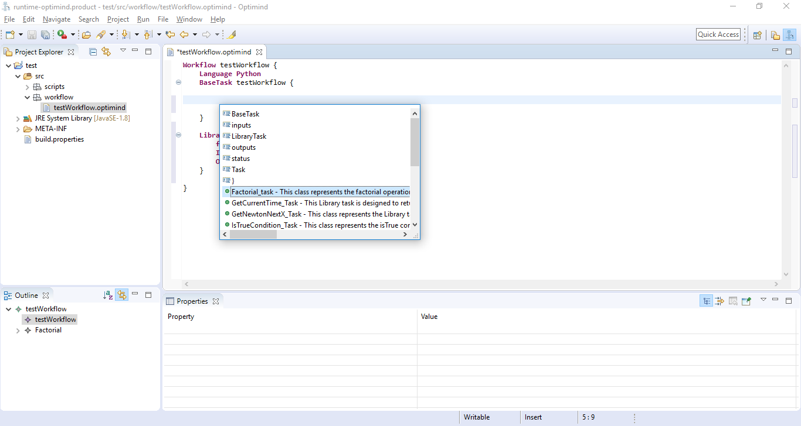

After saving ".optimind" file, the python script (".py" file) referenced in the "library function" should appear in the "Project Explorer" (which may need to be refreshed with *F5*). Double clicking the script should open it in a new tab.

The library function can then be used as a "Library Task" in the workflow.

### Subtasks

A subtask is a "Base Task" held inside another "Base Task". It can itself contain any number of tasks. In the following example, "sub" is a subtask of "main".

A subtask is created by adding a "BaseTask" object inside the parent task.

>**Note**
>
>Moving a task in a subtask will affect the reference to its outputs (used in Connection inputs).
>	"task.output" becomes "subtask.task.output"

## Handling inputs and outputs

### Setters

Setters are fixed inputs, independant of any other task. They must be assigned :

* A name
* A type
* A value

Syntax:

	Setter *name* type *type* value *value*

### Connections

Connections are inputs refering to the output of another task. They must be assigned :

* A name 
* A reference to the output

Syntax:

	Connection *name* to *reference*

>**Tip**
>
>Use the contextual help (*Ctrl+Space*) to find the output reference easily.

### Outputs

Outputs can be refered to by as many connections as necessary. They must be assigned :

* A name
* A type

Syntax :

	Output *name* type *type*

### Example

## Generating Workflow Graph

Optimind offers the possibility to generate and live-preview a graphical representation of workflow. They can easily access to this feature by :

	Right click on .optimind file -> Show Graph

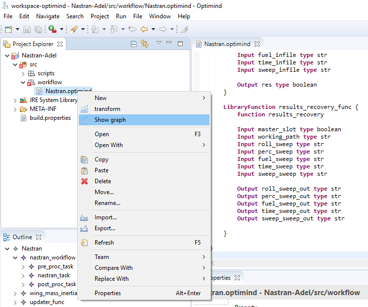

The tool opens a new view that shows the generated graph.

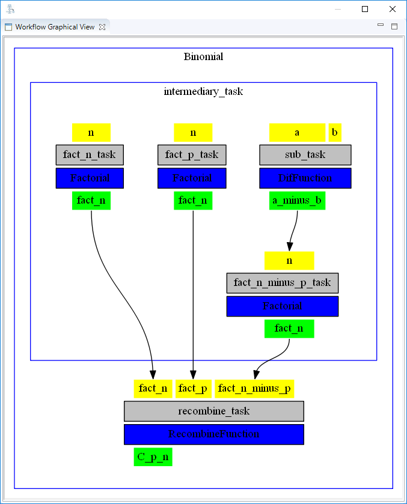

**Colors :**

Yellow : Inputs

Green : Outputs

Gray : Tasks

Light Blue : Runners

Blue : Library Functions

>**Tip** 
>
>Check the *src/workflow* folder (refresh it), you will find exportable versions (*png* and *pdf*) of the workflow graph.
>

### Outline view

Outline is another interesting view shown automatically by Optimind. It consists of a tree structure of the workflow.

	Windows > Show View > Other > General > Outline	

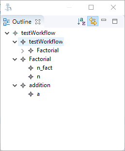